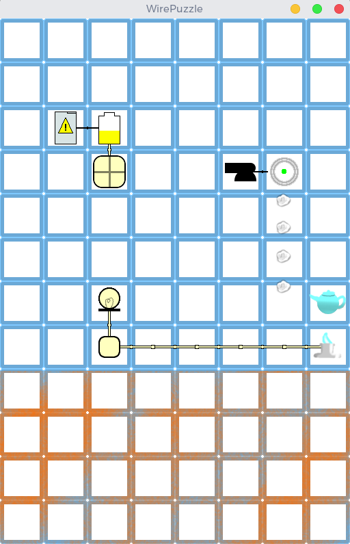

# WirePuzzle
A HaxeFlixel clone of ElectricBox

This is WirePuzzle, a puzzle game involving placing widgets onto a game board to get electricity from the power button to the power box.

It is made with [HaxeFlixel](http://haxeflixel.com), and therefore, technically available on all supported platforms of [OpenFL](http://www.openfl.org/).
Emphasis on the word *technically*, the game is not optimized nor tested for any platform other than the desktop.

## Compilation and Installation
Compilation is easy, simply download [Haxe (and haxelib)](https://haxe.org/download/), 
then in the terminal or command-prompt run `haxelib install openfl` and `haxelib install flixel` (Note: you will have to have haxelib in your PATH which may or may not have been done by your installer).
You should now have flixel and OpenFL installed.
Next make sure you have cloned (or downloaded and extracted) the [project](https://github.com/MightyAlex200/WirePuzzle).
After this, simply change directory to the root of the project (`cd WirePuzzle`) and run `openfl test YOURTARGETHERE` where `YOURTARGETHERE` is replaced with one of OpenFL's supported targets (windows, linux, mac, etc.). The project will build to `export/` and run.

## I found a bug! What do I do?
GitHub has a built-in [issue tracker](https://github.com/MightyAlex200/WirePuzzle/issues), simply click that link and click "New issue".
To have a valid bug report, the bug must be reproducable (no one off things that never happen again)